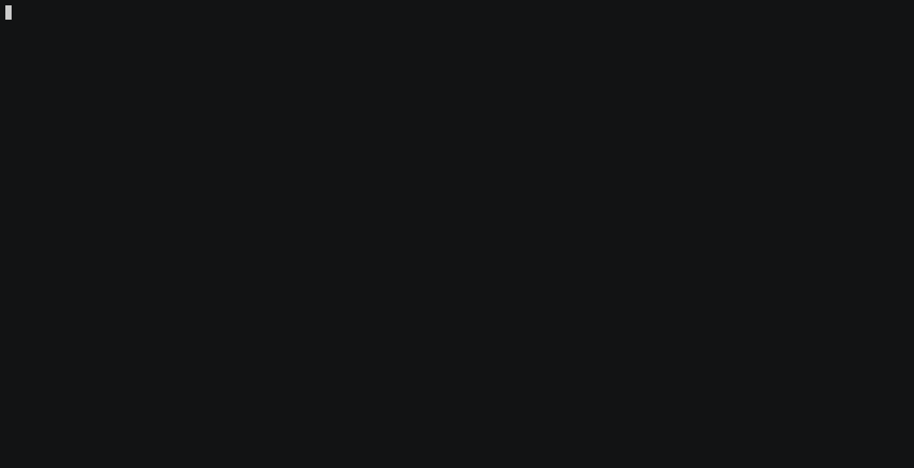

.. raw:: html

    

      
    

    <h1 align="center">django-anon</h1>
    

      <strong>:shipit: Anonymize production data so it can be safely used in not-so-safe environments</strong>
    

    

      
    

**django-anon** will help you anonymize your production database so it can be
shared among developers, helping to reproduce bugs and make performance improvements
in a production-like environment.

Features
########

.. csv-table::

   "🚀", "**Really fast** data anonymization and database operations using bulk updates to operate over huge tables"
   "🍰", "**Flexible** to use your own anonymization functions or external libraries like `Faker <https://faker.readthedocs.io/en/latest/index.html>`_"
   "🐩", "**Elegant** solution following consolidated patterns from projects like `Django <https://djangoproject.com/>`_ and `Factory Boy <https://factoryboy.readthedocs.io/en/latest/index.html>`_"
   "🔨", "**Powerful**. It can be used on any projects, not only Django, not only Python. Really!"

Table of Contents
#################
.. contents::
   :local:

Usage
=====

Use ``anon.BaseAnonymizer`` to define your anonymizer classes:

.. code-block:: python

   import anon
   from your_app.models import Person

   class PersonAnonymizer(anon.BaseAnonymizer):
      email = anon.fake_email

      class Meta:
         model = Person

   # run anonymizer: be cautious, this will affect your current database!
   PersonAnonymizer().run()

Using static values
-------------------

.. code-block:: python

   import anon
   from your_app.models import Person

   class PersonAnonymizer(anon.BaseAnonymizer):
      is_admin = False
      some_other_field = ''

      class Meta:
         model = Person

Using lazy values
-----------------

Lazy attributes can be defined as inline lambdas or methods, as shown below,
using the :func:`anon.lazy_attribute` function/decorator.

.. code-block:: python

   import anon
   from your_app.models import Person

   class PersonAnonymizer(anon.BaseAnonymizer):
      name = anon.lazy_attribute(lambda o: 'x' * len(o.name))

      @lazy_attribute
      def date_of_birth(self):
         # keep year and month
         return self.date_of_birth.replace(day=1)

      class Meta:
         model = Person

The clean method
----------------

.. code-block:: python

   import anon

   class UserAnonymizer(anon.BaseAnonymizer):
      class Meta:
         model = User

      def clean(self, obj):
         obj.set_password('test')
         obj.save()

Using a custom QuerySet
-----------------------

A custom QuerySet can be used to select the rows that should be anonymized:

.. code-block:: python

   import anon
   from your_app.models import Person

   class PersonAnonymizer(anon.BaseAnonymizer):
      email = anon.fake_email

      class Meta:
         model = Person

      def get_queryset(self):
         # keep admins unmodified
         return Person.objects.exclude(is_admin=True)

Faker
-----

`Faker <https://faker.readthedocs.io/en/latest/index.html>`_ can be used to
provide high-quality fake data:

.. code-block:: python

   import anon
   from faker import Faker
   from your_app.models import Address

   faker = Faker()

   class PersonAnonymizer(anon.BaseAnonymizer):
      postalcode = faker.postalcode

      class Meta:
         model = Address

----

`Icon <icon.svg>`_ made by `Eucalyp <https://www.flaticon.com/authors/eucalyp>`_ from `www.flaticon.com <https://www.flaticon.com/>`_
